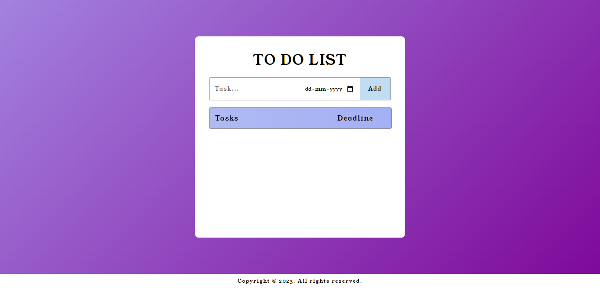
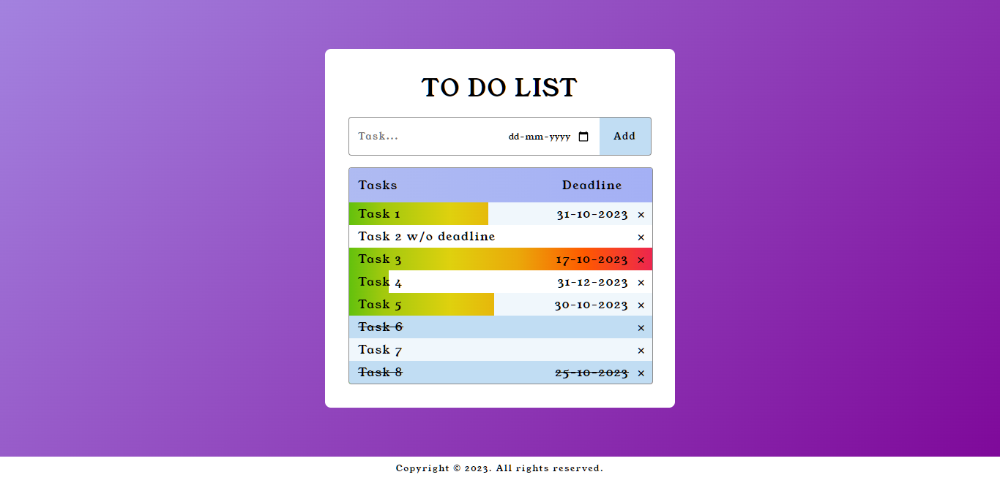

# To-Do List

This project uses HTML, CSS, and JavaScript.  
It features a deadline depenedent background bar.

## Using this Repo

Fork this repository. Go to the forked repo and clone it into your local device.  
Open the `to-do.html` on your preferred Web Browser.  
Viola! You can preview the to do list.

## Final Output

